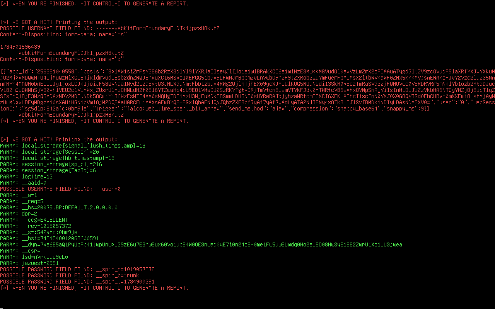
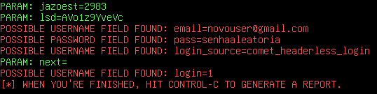

### Ferramentas

Kali Linux
setoolkit
editor de texto linux

### Configurando o Phishing no Kali Linux:

Acesso root: ```sudo su```

Iniciando o setoolkit: ```setoolkit```

Tipo de ataque: ```Social-Engineering Attacks```

Vetor de ataque: ```Web Site Attack Vectors```

Método de ataque: ```Credential Harvester Attack Method```

Método de ataque: ```Site Cloner```

Obtendo o endereço da máquina: ```ifconfig```

URL para clone: http://www.facebook.com

### Resutados antes de resolver:



### Como resolver

Issue que achei para resolver o problema: https://github.com/cassiano-dio/cibersecurity-desafio-phishing/issues/95

Remover script de segurança da pagina copiada: https://github.com/RLLKLLSS/cibersecurity-desafio-phishing/blob/master/README.md

#### Reexecutando após seguir os passos acima

##### Para compartilhar arquivos com a máquina virtual (caso precise)

  - Linux (ex.: Ubuntu):
  
    - Instale os "Guest Additions":
      
      - No menu do VirtualBox, vá em Dispositivos > Inserir imagem de CD dos Adicionais para Convidado.
  
    - Abra o terminal na VM e monte o CD:
  
      - ```sudo mount /dev/cdrom /mnt```
    
      - ```cd /mnt```
    
      - ```sudo ./VBoxLinuxAdditions.run```
  
    - Reinicie a VM.
  
    - Acesse a pasta compartilhada:
    
      - Por padrão, a pasta compartilhada estará em /media/sf_<nome_da_pasta>.

Método de ataque: Custom Import

Pagina copiada para o diretorio interno: /media/sf_satander

De onde copiar: Copy the entire folder

URL do site importado: www.facebook.com

### Resultado após resolver:


